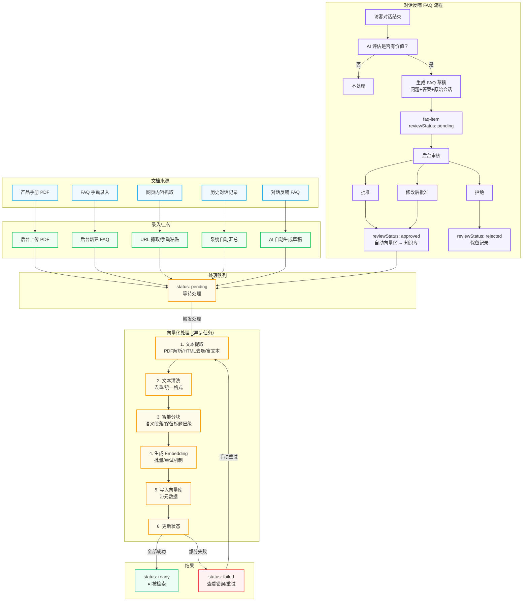
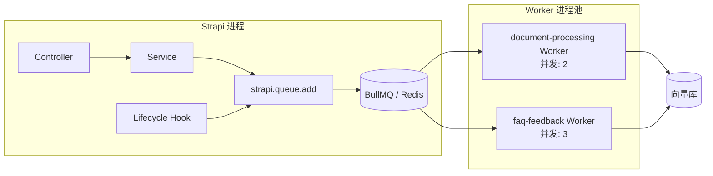

# 子项目 1：基础设施 + Strapi 内容模型 — 设计规格

> 创建日期：2026-07-11
> 状态：待审查
> 上级项目：企业官网母站系统（Figma 前端 + Strapi 后端 + 多客户部署）

## 1. 背景与目标

构建一个可复用的企业官网母站系统，前期服务幼小教育行业客户，后期扩展到制造业等其他行业。母站要求：

- 前端基于 Figma 导出的 React 代码，迁移到 Next.js 实现服务端渲染
- 后端使用 Strapi v5 作为 CMS，支持可视化内容编辑
- 支持 Strapi + MeiliSearch 的全功能产品搜索筛选
- 支持中英双语、SEO/GEO 优化、微信分享
- 支持基于知识库的 AI 客服系统（RAG 架构）
- 一键 Docker 部署，快速复制到新客户

整个系统拆分为 7 个子项目，本规格仅覆盖**子项目 1：基础设施 + Strapi 内容模型**。

### 子项目拆分总览

| # | 子项目 | 内容 | 依赖 |
|---|--------|------|------|
| 1 | 基础设施 + Strapi 内容模型 | Docker 环境、内容模型、权限、数据模型预留 | 无 |
| 2 | Next.js 前端骨架 + SectionRenderer | 项目初始化、区块渲染器、基础区块、首页跑通 | 1 |
| 3 | 内容管理完善 + 全部区块 | 16 种区块、多页面路由、后台编辑流程 | 1, 2 |
| 4 | 产品体系 + 搜索筛选对比 | 产品集合、MeiliSearch、筛选对比 | 1, 2 |
| 5 | 多语言 + SEO/GEO + 微信分享 | 本地化、hreflang、llms.txt、微信 JS-SDK | 1, 2, 3 |
| 6 | 母站部署 + 多客户能力 | Docker 完善、一键部署、数据隔离、备份恢复 | 1-5 |
| 7 | AI 客服系统 | RAG 知识库、多轮对话、转人工、反哺 FAQ | 1, 2 |

子项目 3 和 4 可并行推进。

## 2. 技术选型

| 项目 | 选型 | 理由 |
|------|------|------|
| CMS | Strapi v5 | 最新版，Document Service API，TypeScript 优先 |
| 数据库 | PostgreSQL 16 | JSONB 字段支持好，产品规格参数会用 JSON |
| 搜索引擎 | MeiliSearch v1.12 | 轻量，中文搜索好，Strapi 插件友好 |
| 容器编排 | Docker Compose | 单机部署，适合中小企业客户 |
| Node 版本 | Node 20 LTS | Strapi v5 最低要求 |
| 仓库结构 | 单仓库分目录 | `backend/` 和 `frontend/` 各自独立 package.json |

## 3. 项目目录结构

```
superpowers-zh/
├── backend/                       # Strapi v5 项目
│   ├── config/
│   │   ├── database.ts
│   │   ├── server.ts
│   │   ├── plugins.ts
│   │   ├── admin.ts
│   │   └── middlewares.ts
│   ├── src/
│   │   ├── api/
│   │   │   ├── page/
│   │   │   │   ├── content-types/page/schema.ts
│   │   │   │   ├── controllers/page.ts
│   │   │   │   ├── routes/page.ts
│   │   │   │   └── services/page.ts
│   │   │   ├── form-submission/
│   │   │   ├── appointment/
│   │   │   ├── chat-session/
│   │   │   ├── chat-message/
│   │   │   ├── knowledge-base/
│   │   │   └── faq-item/
│   │   ├── components/
│   │   │   ├── sections/          # Dynamic Zone 区块
│   │   │   │   ├── hero.json
│   │   │   │   ├── advantages.json
│   │   │   │   └── rich-text.json
│   │   │   ├── shared/            # 共享组件
│   │   │   │   ├── seo.json
│   │   │   │   ├── cta-button.json
│   │   │   │   ├── stat-item.json
│   │   │   │   ├── advantage-item.json
│   │   │   │   ├── nav-item.json
│   │   │   │   ├── footer-link-group.json
│   │   │   │   ├── footer-link.json
│   │   │   │   ├── page-layout.json
│   │   │   │   └── floating-action.json
│   │   │   └── single-types/     # 单例内容
│   │   ├── extensions/
│   │   └── index.ts
│   ├── public/
│   ├── package.json
│   ├── tsconfig.json
│   └── .env.example
├── frontend/                      # 子项目 2 创建
├── docker/
│   ├── docker-compose.yml         # 开发环境
│   ├── docker-compose.prod.yml    # 生产环境
│   ├── strapi/Dockerfile
│   └── postgres/init.sql
├── docs/
│   └── superpowers/specs/
└── （原有仓库文件不变）
```

## 4. Docker Compose 配置

### 4.1 服务配置

| 服务 | 镜像 | 端口 | 数据卷 | 资源限制 |
|------|------|------|--------|---------|
| PostgreSQL 16 | `postgres:16-alpine` | 5432 | `pg_data` | 512MB |
| Strapi v5 | 自建（`node:20-alpine` 基础） | 1337 | 无（代码挂载） | 1GB |
| MeiliSearch | `getmeili/meilisearch:v1.12` | 7700 | `ms_data` | 1GB |

### 4.2 网络与持久化

- 三个服务在同一 Docker network 下，用服务名互访
- PostgreSQL 数据持久化到 named volume `pg_data`
- MeiliSearch 数据持久化到 named volume `ms_data`
- Strapi 开发环境挂载源码目录，生产环境用构建好的镜像

### 4.3 环境变量（`.env.example`）

```env
# PostgreSQL
POSTGRES_HOST=postgres
POSTGRES_PORT=5432
POSTGRES_DB=strapi
POSTGRES_USER=strapi
POSTGRES_PASSWORD=changeme

# Strapi
HOST=0.0.0.0
PORT=1337
APP_KEYS="key1,key2,key3,key4"
API_TOKEN_SALT=changeme
ADMIN_JWT_SECRET=changeme
TRANSFER_TOKEN_SALT=changeme
JWT_SECRET=changeme
DATABASE_CLIENT=postgres
DATABASE_HOST=postgres
DATABASE_PORT=5432
DATABASE_NAME=strapi
DATABASE_USERNAME=strapi
DATABASE_PASSWORD=changeme
DATABASE_SSL=false

# MeiliSearch
MEILI_HOST=http://meilisearch:7700
MEILI_MASTER_KEY=changeme
MEILI_NO_ANALYTICS=true
```

### 4.4 生产环境差异

- Strapi 用 `NODE_ENV=production`，构建产物镜像
- PostgreSQL 强制密码、限制连接数
- MeiliSearch 强制 master key
- 不挂载源码，用构建好的镜像
- 加 healthcheck 和 restart policy
- 日志统一输出到 named volume

## 5. Strapi 内容模型

### 5.1 全局单例（Single Types）

#### 5.1.1 `site-settings` — 站点设置

| 字段名 | 类型 | 说明 |
|--------|------|------|
| `siteName` | Text | 站点名称 |
| `siteNameEn` | Text | 站点英文名 |
| `logo` | Media (single) | Logo 图片 |
| `logoFavicon` | Media (single) | Favicon |
| `domain` | Text | 站点域名（生成 hreflang、canonical 用） |
| `defaultLocale` | Enumeration (zh-CN, en-US) | 默认语言 |
| `supportedLocales` | JSON | 支持的语言列表 |
| `icp` | Text | ICP 备案号 |
| `publicSecurityRecord` | Text | 公安备案号 |
| `themeColorPrimary` | Text | 主题主色 |
| `themeColorSecondary` | Text | 主题辅色 |
| `wechatAppId` | Text | 微信 AppId（JS-SDK） |
| `wechatAppSecret` | Password | 微信 AppSecret |
| `aiCrawlable` | Boolean | 是否允许 AI 爬虫 |
| `aiSummary` | Textarea (long) | 给 AI 的网站摘要（GEO） |

> 子项目 1 实现基础字段，SEO/微信/GEO 的完整字段在子项目 5 补充。

#### 5.1.2 `navigation` — 导航菜单

| 字段名 | 类型 | 说明 |
|--------|------|------|
| `items` | Component (repeatable, `shared.nav-item`) | 导航项列表 |

**`shared.nav-item` 组件：**

| 字段 | 类型 | 说明 |
|------|------|------|
| `label` | Text | 显示文字 |
| `labelEn` | Text | 英文文字 |
| `url` | Text | 链接地址 |
| `target` | Enumeration (self, blank) | 打开方式 |
| `children` | Component (repeatable, `shared.nav-item`) | 下级菜单（自引用，支持二级） |

#### 5.1.3 `footer` — 页脚配置

| 字段名 | 类型 | 说明 |
|--------|------|------|
| `description` | RichText | 公司简介 |
| `contactPhone` | Text | 联系电话 |
| `contactEmail` | Email | 联系邮箱 |
| `contactAddress` | Text | 地址 |
| `contactAddressEn` | Text | 英文地址 |
| `longitude` | Decimal | 经度 |
| `latitude` | Decimal | 纬度 |
| `linkGroups` | Component (repeatable, `shared.footer-link-group`) | 链接分组 |
| `qrCode` | Media (single) | 二维码图片 |
| `copyright` | Text | 版权文字 |

**`shared.footer-link-group` 组件：**

| 字段 | 类型 | 说明 |
|------|------|------|
| `title` | Text | 分组标题 |
| `links` | Component (repeatable, `shared.footer-link`) | 链接列表 |

**`shared.footer-link` 组件：**

| 字段 | 类型 | 说明 |
|------|------|------|
| `label` | Text | 显示文字 |
| `url` | Text | 链接地址 |

### 5.2 Collection Type: `page` — 页面

| 字段名 | 类型 | 说明 |
|--------|------|------|
| `title` | Text | 页面标题（必填） |
| `slug` | UID (target: title) | URL 路径（必填，唯一） |
| `locale` | Locale | 语言版本（本地化插件开启后自动有） |
| `status` | Enumeration (draft, published) | 发布状态 |
| `publishDate` | DateTime | 发布时间 |
| `sections` | Dynamic Zone | 动态区块（核心） |
| `seo` | Component (single, `shared.seo`) | SEO 信息 |
| `layout` | Component (single, `shared.page-layout`) | 布局配置 |

**`shared.page-layout` 组件：**

| 字段 | 类型 | 说明 |
|------|------|------|
| `showNavbar` | Boolean | 是否显示导航栏（默认 true） |
| `showFooter` | Boolean | 是否显示页脚（默认 true） |
| `showFloatingActions` | Enumeration (global, custom, hidden) | 浮动按钮显示方式 |
| `customFloatingActions` | Component (single, `shared.floating-action`) | 自定义浮动按钮 |

**`shared.floating-action` 组件：**

| 字段 | 类型 | 说明 |
|------|------|------|
| `items` | Component (repeatable, `shared.floating-action-item`) | 浮动按钮项列表 |
| `position` | Enumeration (left-bottom, right-bottom, left-center, right-center) | 位置 |

**`shared.floating-action-item` 组件：**

| 字段 | 类型 | 说明 |
|------|------|------|
| `type` | Enumeration (phone, wechat, online-chat, custom-link) | 类型 |
| `label` | Text | 显示文字 |
| `icon` | Text | 图标名 |
| `url` | Text | 链接（custom-link 用） |
| `phoneNumber` | Text | 电话（phone 类型用） |
| `wechatId` | Text | 微信号（wechat 类型用） |

**`shared.seo` 组件：**

| 字段 | 类型 | 说明 |
|--------|------|------|
| `metaTitle` | Text | 页面标题 |
| `metaDescription` | Textarea | 描述 |
| `keywords` | Text | 关键词 |
| `ogImage` | Media (single) | 分享图 |
| `noIndex` | Boolean | 禁止索引 |
| `canonicalUrl` | Text | 规范链接 |
| `structuredData` | JSON | 结构化数据 |

> 子项目 1 建字段结构，GEO 的 `aiSummary`、`keyFacts` 在子项目 5 补充。

### 5.3 Dynamic Zone 区块组件（子项目 1 做 3 个基础区块）

#### 5.3.1 `sections.hero` — Hero 首屏

| 字段 | 类型 | 说明 |
|------|------|------|
| `badge` | Text | 徽章文字 |
| `title` | Text | 主标题 |
| `titleHighlight` | Text | 标题高亮文字 |
| `subtitle` | Textarea | 副标题 |
| `backgroundImage` | Media (single) | 背景图 |
| `overlayOpacity` | Number (0-100) | 背景遮罩透明度 |
| `stats` | Component (repeatable, `shared.stat-item`) | 统计数字列表 |
| `primaryCta` | Component (single, `shared.cta-button`) | 主按钮 |
| `secondaryCta` | Component (single, `shared.cta-button`) | 次按钮 |

**`shared.stat-item` 组件：**

| 字段 | 类型 |
|------|------|
| `number` | Text |
| `label` | Text |

**`shared.cta-button` 组件：**

| 字段 | 类型 |
|------|------|
| `text` | Text |
| `url` | Text |
| `icon` | Text |
| `style` | Enumeration (primary, secondary, outline) |

#### 5.3.2 `sections.advantages` — 核心优势

| 字段 | 类型 | 说明 |
|------|------|------|
| `badge` | Text | 区块徽章 |
| `title` | Text | 区块标题 |
| `subtitle` | Textarea | 区块副标题 |
| `items` | Component (repeatable, `shared.advantage-item`) | 优势项列表 |

**`shared.advantage-item` 组件：**

| 字段 | 类型 | 说明 |
|------|------|------|
| `icon` | Text | 图标名（Lucide 图标名） |
| `title` | Text | 标题 |
| `description` | Textarea | 描述 |
| `color` | Text | 图标颜色 |
| `bgColor` | Text | 图标背景色 |

#### 5.3.3 `sections.rich-text` — 富文本内容

| 字段 | 类型 | 说明 |
|------|------|------|
| `badge` | Text | 区块徽章（可选） |
| `title` | Text | 区块标题（可选） |
| `content` | RichText (Blocks) | 富文本内容 |
| `backgroundColor` | Text | 背景色 |

### 5.4 用户提交数据 Collection Types

#### 5.4.1 `form-submission` — 表单提交

| 字段名 | 类型 | 说明 |
|--------|------|------|
| `formType` | Enumeration (contact, consultation, callback, custom) | 表单类型 |
| `pageSlug` | Text | 来源页面 |
| `name` | Text | 姓名 |
| `phone` | Text | 电话 |
| `email` | Email | 邮箱（可选） |
| `message` | Textarea (long) | 留言内容 |
| `extraData` | JSON | 其他字段 |
| `status` | Enumeration (new, processing, resolved, spam) | 处理状态 |
| `assignedTo` | Relation (admin user) | 处理人 |
| `notes` | Textarea (long) | 后台备注 |
| `ipAddress` | Text | IP 地址 |
| `userAgent` | Text | 浏览器信息 |
| `createdAt` | DateTime (auto) | 提交时间 |

#### 5.4.2 `appointment` — 预约试听

| 字段名 | 类型 | 说明 |
|--------|------|------|
| `childName` | Text | 孩子姓名 |
| `parentName` | Text | 家长姓名 |
| `phone` | Text | 联系电话 |
| `age` | Number | 孩子年龄 |
| `course` | Text | 感兴趣的课程 |
| `preferredDate` | Date | 期望日期 |
| `preferredTimeSlot` | Enumeration (morning, afternoon, evening) | 期望时段 |
| `campus` | Text | 期望校区 |
| `message` | Textarea (long) | 备注 |
| `status` | Enumeration (pending, confirmed, completed, cancelled) | 预约状态 |
| `assignedTo` | Relation (admin user) | 跟进人 |
| `notes` | Textarea (long) | 后台备注 |
| `sourcePage` | Text | 来源页面 |
| `createdAt` | DateTime (auto) | 提交时间 |

### 5.5 AI 客服数据模型预留

#### 5.5.1 `knowledge-base` — 知识库文档

| 字段名 | 类型 | 说明 |
|--------|------|------|
| `title` | Text | 文档标题 |
| `sourceType` | Enumeration (manual, faq, pdf, webpage, chat-history) | 来源类型 |
| `file` | Media (single) | 原始文件 |
| `content` | RichText (Blocks) | 文本内容 |
| `sourceUrl` | Text | 来源 URL |
| `category` | Text | 分类 |
| `status` | Enumeration (pending, processing, ready, failed) | 向量化状态 |
| `chunkCount` | Number | 分块数量 |
| `vectorDbIds` | JSON | 向量数据库 chunk ID 列表 |
| `tags` | Text | 标签 |
| `uploadedBy` | Relation (admin user) | 上传人 |
| `createdAt` | DateTime (auto) | 创建时间 |
| `updatedAt` | DateTime (auto) | 更新时间 |

#### 5.5.2 `faq-item` — 常见问题

| 字段名 | 类型 | 说明 |
|--------|------|------|
| `question` | Text | 问题 |
| `answer` | Textarea (long) | 答案 |
| `category` | Text | 分类 |
| `sourceType` | Enumeration (manual, auto-from-chat) | 来源 |
| `sourceSession` | Relation (chat-session) | 来源会话 |
| `reviewStatus` | Enumeration (pending, approved, rejected) | 审核状态 |
| `vectorSynced` | Boolean | 是否已同步到向量库 |
| `sortOrder` | Number | 排序 |
| `publishedAt` | DateTime | 发布时间 |

#### 5.5.3 `chat-session` — 对话会话

| 字段名 | 类型 | 说明 |
|--------|------|------|
| `sessionId` | Text (UID) | 会话 ID |
| `visitorName` | Text | 访客姓名 |
| `visitorPhone` | Text | 访客电话 |
| `visitorEmail` | Email | 访客邮箱 |
| `sourcePage` | Text | 发起页面 |
| `status` | Enumeration (active, transferred-human, ended, abandoned) | 会话状态 |
| `transferReason` | Text | 转人工原因 |
| `assignedAgent` | Relation (admin user) | 人工客服 |
| `transferredAt` | DateTime | 转人工时间 |
| `messageCount` | Number | 消息数 |
| `summary` | Textarea | AI 生成的对话摘要 |
| `leadIntent` | Enumeration (consultation, appointment, support, complaint, other) | 意图分类 |
| `leadInfo` | JSON | 收集到的线索信息 |
| `satisfactionScore` | Number | 满意度评分（1-5） |
| `canFeedbackToFaq` | Boolean | 是否可反哺为 FAQ |
| `feedbackStatus` | Enumeration (none, pending, converted, rejected) | 反哺状态 |
| `createdAt` | DateTime (auto) | 创建时间 |
| `updatedAt` | DateTime (auto) | 最后活动时间 |

#### 5.5.4 `chat-message` — 对话消息

| 字段名 | 类型 | 说明 |
|--------|------|------|
| `session` | Relation (chat-session) | 所属会话 |
| `role` | Enumeration (user, assistant, system, human-agent) | 角色 |
| `content` | Textarea (long) | 消息内容 |
| `attachments` | Media (multiple) | 附件 |
| `retrievedContext` | JSON | RAG 检索到的上下文 |
| `retrievedSources` | JSON | 引用的知识库来源 |
| `confidence` | Number | AI 回答置信度（0-1） |
| `isTransferred` | Boolean | 是否触发转人工 |
| `metadata` | JSON | 元数据 |
| `createdAt` | DateTime (auto) | 发送时间 |

#### 5.5.5 `ai-config` — AI 配置（Single Type）

| 字段名 | 类型 | 说明 |
|--------|------|------|
| `provider` | Enumeration (openai, deepseek, qwen, wenxin, kimi, custom) | 模型供应商 |
| `apiKey` | Password | API Key |
| `apiEndpoint` | Text | API 地址 |
| `modelName` | Text | 模型名 |
| `temperature` | Number | 温度参数 |
| `maxTokens` | Number | 最大 token 数 |
| `systemPrompt` | Textarea (long) | 系统提示词 |
| `transferThreshold` | Number | 转人工置信度阈值 |
| `welcomeMessage` | Textarea | 欢迎语 |
| `transferMessage` | Textarea | 转人工提示语 |
| `enabled` | Boolean | 是否启用 AI 客服 |
| `feedbackToFaqEnabled` | Boolean | 是否开启对话反哺 FAQ |

#### 5.5.6 `vector-config` — 向量库配置（Single Type）

| 字段名 | 类型 | 说明 |
|--------|------|------|
| `provider` | Enumeration (qdrant, milvus, pgvector) | 向量库类型 |
| `host` | Text | 地址 |
| `apiKey` | Password | 密钥 |
| `collectionName` | Text | 集合名 |
| `embeddingModel` | Text | Embedding 模型 |
| `embeddingDimensions` | Number | 向量维度 |
| `chunkSize` | Number | 分块大小 |
| `chunkOverlap` | Number | 分块重叠 |

> 向量库不使用 MeiliSearch，因为 MeiliSearch 向量搜索能力有限。MeiliSearch 专注做产品全文搜索，向量库独立选型。

### 5.6 知识库维护流程

知识库维护是 AI 客服系统的核心环节，涉及多种来源、多个角色、多步处理。以下是完整的维护流程。

#### 5.6.1 整体流程图



#### 5.6.2 文档来源与录入方式

| 来源类型 | 录入方式 | 操作者 | 说明 |
|---------|---------|--------|------|
| **产品手册 PDF** | 后台上传 PDF 文件 | 超级管理员 / 客户管理员 | 支持多文件批量上传，自动解析文本 |
| **FAQ（手动）** | 后台新建 FAQ 条目 | 客户管理员 | 直接填写问题和答案，分类 |
| **网页内容** | 输入 URL 自动抓取 或 手动粘贴 | 超级管理员 | 抓取网站页面内容，去重清洗 |
| **历史对话记录** | 自动从 chat-session 汇总 | 系统自动 | 高质量对话自动进入候选池 |
| **对话反哺 FAQ** | 对话结束后标记可反哺 → 后台审核 | 系统 + 人工审核 | 客户常见问题自动生成 FAQ 草稿 |

#### 5.6.3 文档处理流水线

每份文档进入系统后，经历以下状态转换：

```
pending → processing → ready
                ↓
             failed（可重试）
```

**各状态说明：**

| 状态 | 触发条件 | 可操作 |
|------|---------|--------|
| `pending` | 文档刚上传/录入，等待处理 | 编辑、删除、手动触发处理 |
| `processing` | 正在进行文本解析、分块、向量化 | 取消处理 |
| `ready` | 向量化完成，可被检索 | 编辑（修改后重新向量化）、删除、停用 |
| `failed` | 处理失败（解析失败、API 调用失败等） | 查看错误、重试、删除 |

**处理步骤（异步任务）：**

1. **文本提取**
   - PDF：用 PDF 解析库提取文字、表格、图片 OCR（可选）
   - 网页：HTML 正文提取、去噪（去掉导航、页脚、广告）
   - 富文本：直接用内容
   - FAQ：问题 + 答案组合成完整条目

2. **文本清洗**
   - 去除多余空白、特殊字符
   - 统一编码和换行
   - 去除重复内容（与已有知识库对比相似度）

3. **智能分块**
   - 按语义段落分块（不是简单按字数切）
   - 块大小：默认 500-1000 字符（可配置）
   - 块重叠：默认 20%（可配置），保证上下文连续
   - 保留标题层级信息（H1/H2/H3 作为块的元数据）

4. **生成 Embedding**
   - 调用配置的 Embedding 模型生成向量
   - 批量处理，控制并发数
   - 失败自动重试（最多 3 次）

5. **写入向量库**
   - 每个 chunk 写入向量库，带上元数据（文档 ID、标题、分类、来源类型、块索引）
   - 同时保存 Strapi 中的 `vectorDbIds` 字段

6. **更新状态**
   - 全部成功 → `ready`，记录 `chunkCount`
   - 部分失败 → `failed`，记录错误信息

#### 5.6.4 对话反哺 FAQ 流程

```
访客对话结束
    ↓
AI 自动评估是否有价值？
    ├── 否 → 不处理
    └── 是 → 生成 FAQ 草稿（问题 + 答案 + 原始会话）
              ↓
         进入 faq-item，reviewStatus=pending
              ↓
         后台审核列表
              ├── 批准 → reviewStatus=approved → 自动向量化 → 进入知识库
              ├── 修改后批准 → 编辑内容 → approved → 向量化
              └── 拒绝 → reviewStatus=rejected（保留记录，不再显示）
```

**AI 评估"有价值"的标准：**
- 对话超过 5 轮
- 访客明确表示"明白了"、"谢谢"等满意信号
- 问题不在已有 FAQ 中（语义相似度低于阈值）
- 问题具有通用性（不是个性化的订单查询等）

**审核界面功能：**
- 列出所有待审核的反哺 FAQ
- 显示原始对话上下文（帮助审核者理解背景）
- 一键编辑问题和答案
- 批量批准 / 批量拒绝
- 按分类、日期筛选

#### 5.6.5 角色与职责

| 操作 | 超级管理员 | 客户管理员 | 系统自动 |
|------|----------|----------|----------|
| 上传 PDF 文档 | ✅ | ✅（需培训后） | — |
| 手动录入 FAQ | ✅ | ✅ | — |
| 抓取网页内容 | ✅ | ❌ | — |
| 查看知识库列表 | ✅ | ✅ | — |
| 编辑文档内容 | ✅ | ✅ | — |
| 删除文档 | ✅ | ✅ | — |
| 手动触发重新向量化 | ✅ | ✅ | — |
| 审核反哺 FAQ | ✅ | ✅ | — |
| 配置向量库参数 | ✅ | ❌ | — |
| 配置 AI 模型参数 | ✅ | ❌ | — |
| 文档处理流水线 | — | — | ✅ |
| 对话反哺 FAQ 生成 | — | — | ✅ |
| 内容修改后自动重新向量化 | — | — | ✅ |

#### 5.6.6 知识库管理后台页面

后台提供专门的知识库管理模块，包含：

**1. 文档列表页**
- 按分类、来源类型、状态筛选
- 搜索（标题 + 内容全文搜索）
- 批量操作（批量删除、批量重新向量化、批量修改分类）
- 显示每篇文档的状态、chunk 数量、上传时间、最后更新时间

**2. 文档详情/编辑页**
- 编辑标题、分类、标签
- 预览解析后的文本内容
- 查看分块列表（每个块的内容和向量 ID）
- 手动触发重新向量化
- 查看处理历史（每次向量化的时间、结果、耗时）

**3. 反哺审核页**
- 待审核列表（按时间倒序）
- 每条显示：问题、AI 生成的答案、原始会话摘要
- 操作：批准、编辑后批准、拒绝
- 已审核历史（可查看已批准/已拒绝的）

**4. 统计仪表盘**
- 知识库总文档数、总 chunk 数
- 各分类文档数量分布
- 各来源类型占比
- 最近 7 天新增文档数
- 反哺 FAQ 统计（待审核、已批准、已拒绝数量）
- 检索调用量、平均响应时间（子项目 7 实现）

#### 5.6.7 技术实现要点（子项目 7 详细设计）

子项目 1 只做数据模型预留，以下要点在子项目 7 实现时细化：

1. **异步任务处理**：用 Strapi 的 cron 任务或 BullMQ 队列处理文档向量化，避免阻塞请求
2. **PDF 解析**：用 `pdf-parse` 或 `@react-pdf/renderer` 服务端解析，复杂 PDF 考虑调用第三方服务
3. **Embedding 接口封装**：统一封装多供应商的 Embedding API（OpenAI、文心、通义等）
4. **向量库抽象层**：封装向量库操作，支持 Qdrant / Milvus / pgvector 切换
5. **去重机制**：新文档入库前与已有文档做语义相似度比对，高于阈值则提示重复
6. **Webhook 通知**：文档处理完成后可配置 webhook 通知（可选）
7. **增量更新**：文档修改后只重新向量化修改的部分（如果能精确识别），否则全量重新向量化

### 5.7 知识库核心 API 接口清单

以下接口按开发优先级排序。子项目 1 只做数据模型预留，接口实现在子项目 7 完成。

#### 5.7.1 P0（最核心，MVP 必须有）

| 接口 | 方法 | 路径 | 说明 | 权限 |
|------|------|------|------|------|
| 上传文档 | POST | `/api/knowledge-bases/upload` | 上传 PDF/文档文件，创建文档记录，状态设为 pending | 客户管理员+ |
| 创建文档 | POST | `/api/knowledge-bases` | 手动创建文档（富文本/FAQ） | 客户管理员+ |
| 文档列表 | GET | `/api/knowledge-bases` | 分页列表，支持分类、来源类型、状态筛选、搜索 | 客户管理员+ |
| 文档详情 | GET | `/api/knowledge-bases/:id` | 获取单篇文档详情 + 分块信息 | 客户管理员+ |
| 更新文档 | PUT | `/api/knowledge-bases/:id` | 修改文档内容，修改后自动重新向量化 | 客户管理员+ |
| 删除文档 | DELETE | `/api/knowledge-bases/:id` | 删除文档 + 从向量库移除 | 客户管理员+ |
| 触发向量化 | POST | `/api/knowledge-bases/:id/process` | 手动触发向量化处理 | 客户管理员+ |
| 知识库检索 | POST | `/api/ai-chat/retrieve` | RAG 检索接口，输入 query 返回相关 chunk（AI 对话用） | 访客+ |

#### 5.7.2 P1（重要，第二优先级）

| 接口 | 方法 | 路径 | 说明 | 权限 |
|------|------|------|------|------|
| 批量上传 | POST | `/api/knowledge-bases/batch-upload` | 批量上传多个文件 | 客户管理员+ |
| 批量操作 | POST | `/api/knowledge-bases/batch` | 批量删除/批量重新向量化/批量修改分类 | 客户管理员+ |
| 网页抓取 | POST | `/api/knowledge-bases/crawl` | 输入 URL，抓取网页内容入库 | 超级管理员 |
| FAQ 列表 | GET | `/api/faq-items` | FAQ 列表，支持分类、状态、来源筛选 | 客户管理员+ |
| FAQ 创建 | POST | `/api/faq-items` | 手动创建 FAQ | 客户管理员+ |
| FAQ 更新 | PUT | `/api/faq-items/:id` | 更新 FAQ，自动重新向量化 | 客户管理员+ |
| FAQ 审核列表 | GET | `/api/faq-items/pending-review` | 待审核的反哺 FAQ 列表 | 客户管理员+ |
| FAQ 审核操作 | POST | `/api/faq-items/:id/review` | 批准/拒绝/修改后批准 | 客户管理员+ |

#### 5.7.3 P2（完善，第三优先级）

| 接口 | 方法 | 路径 | 说明 | 权限 |
|------|------|------|------|------|
| 文档处理状态 | GET | `/api/knowledge-bases/:id/status` | 实时查询处理进度（chunk 数、当前状态） | 客户管理员+ |
| 知识库统计 | GET | `/api/knowledge-bases/stats` | 统计仪表盘数据（总数、分类分布、来源占比） | 客户管理员+ |
| 分类管理 | GET/POST/PUT/DELETE | `/api/knowledge-categories` | 文档分类的增删改查 | 客户管理员+ |
| AI 配置获取 | GET | `/api/ai-config` | 获取 AI 配置（不含密钥） | 超级管理员 |
| AI 配置更新 | PUT | `/api/ai-config` | 更新 AI 配置（模型、API Key 等） | 超级管理员 |
| 向量库配置获取 | GET | `/api/vector-config` | 获取向量库配置（不含密钥） | 超级管理员 |
| 向量库配置更新 | PUT | `/api/vector-config` | 更新向量库配置 | 超级管理员 |
| 向量库连通性测试 | POST | `/api/vector-config/test` | 测试向量库连接是否正常 | 超级管理员 |
| 对话会话列表 | GET | `/api/chat-sessions` | 对话记录列表，可查看、筛选 | 客户管理员+ |
| 对话详情 | GET | `/api/chat-sessions/:id` | 单条对话完整消息记录 | 客户管理员+ |
| 标记可反哺 | POST | `/api/chat-sessions/:id/mark-feedback` | 人工标记某对话可反哺为 FAQ | 客户管理员+ |

#### 5.7.4 P3（锦上添花）

| 接口 | 方法 | 路径 | 说明 | 权限 |
|------|------|------|------|------|
| 知识库导出 | POST | `/api/knowledge-bases/export` | 导出知识库为 JSON/Markdown | 客户管理员+ |
| 知识库导入 | POST | `/api/knowledge-bases/import` | 从 JSON 批量导入知识库 | 超级管理员 |
| 检索日志 | GET | `/api/ai-chat/retrieve-logs` | 检索调用日志、命中率统计 | 客户管理员+ |
| 处理日志 | GET | `/api/knowledge-bases/:id/process-history` | 单篇文档的处理历史记录 | 客户管理员+ |
| 相似度检测 | POST | `/api/knowledge-bases/check-duplicate` | 上传前检测是否与已有文档重复 | 客户管理员+ |

#### 5.7.5 接口设计原则

1. **Strapi 自带 REST API 优先复用**：基础 CRUD 直接用 Strapi Document Service API，不用自己写
2. **自定义接口放在扩展路由里**：上传、向量化、检索、审核这些特殊逻辑，写自定义 controller
3. **分页统一格式**：所有列表接口返回 `{ data, meta: { pagination: { page, pageSize, total } } }`
4. **错误响应统一**：`{ error: { code, message, details } }`
5. **权限用 Strapi 内置 RBAC + 自定义 policy**：数据级权限用 policy 补充

### 5.8 代码结构与技术选型

#### 5.8.1 Strapi v5 代码目录结构

```
backend/
└── src/
    ├── api/
    │   └── knowledge-base/
    │       ├── content-types/
    │       │   └── knowledge-base/
    │       │       ├── schema.json       # 内容模型定义
    │       │       └── lifecycle.ts      # 生命周期钩子
    │       ├── controllers/
    │       │   └── knowledge-base.ts     # 自定义 Controller
    │       ├── routes/
    │       │   └── knowledge-base.ts     # 自定义路由 + policy 配置
    │       ├── services/
    │       │   └── knowledge-base.ts     # 自定义 Service（业务逻辑）
    │       ├── policies/                 # 本模块专用 policy
    │       │   └── is-document-owner.ts
    │       └── middlewares/              # 本模块专用 middleware
    ├── extensions/
    │   └── users-permissions/            # 扩展内置插件
    ├── policies/                         # 全局 policy
    │   ├── is-admin.ts
    │   └── is-client-admin.ts
    ├── middlewares/                      # 全局 middleware
    │   ├── request-logger.ts
    │   └── error-handler.ts
    ├── workers/                          # 队列 Worker
    │   ├── document-processor.worker.ts
    │   └── faq-feedback.worker.ts
    ├── utils/                            # 工具函数
    │   ├── queue.ts                      # BullMQ 队列封装
    │   ├── vector-store.ts               # 向量库抽象层
    │   ├── embedding.ts                  # Embedding 封装
    │   ├── pdf-parser.ts                 # PDF 解析
    │   ├── text-chunker.ts               # 文本分块
    │   ├── text-cleaner.ts               # 文本清洗
    │   └── html-to-text.ts               # HTML 转纯文本
    └── index.ts                          # Strapi 入口
```

#### 5.8.2 分层架构原则

| 层级 | 职责 | 不能做什么 |
|------|------|-----------|
| **Controller** | 参数提取、校验、调用 service、格式化响应、错误处理 | 不能直接写业务逻辑 |
| **Service** | 核心业务逻辑（上传处理、向量化流程、检索） | 不能直接操作 HTTP 请求/响应 |
| **Utils** | 通用能力封装（向量库、embedding、PDF 解析） | 不能包含业务逻辑 |
| **Policy** | 权限校验、数据归属判断 | 不能修改数据 |
| **Middleware** | 请求前后处理（日志、CORS、限流） | 不能包含业务逻辑 |
| **Lifecycle Hook** | 数据变更副作用（删除后清理向量库、修改后重新向量化） | 不能阻塞主流程太久 |
| **Worker** | 异步任务处理（向量化、FAQ 反哺） | 不能处理 HTTP 请求 |

**Fat Service, Thin Controller** — 业务逻辑全部放 service，controller 只做参数和响应。

#### 5.8.3 核心依赖库推荐

| 用途 | 推荐库 | 备选 |
|------|--------|------|
| 队列/异步任务 | `bullmq` + Redis | `bee-queue` |
| PDF 解析 | `pdf-parse` | `pdfjs-dist` |
| 文本分块 | `@langchain/textsplitters` | 自行实现 |
| HTTP 请求 | `axios` | 内置 `fetch` |
| 参数校验 | `zod` | `joi` |
| 向量库 | `qdrant`（轻量好用） | `milvus`、`pgvector` |
| Embedding | 直接调 API（OpenAI/文心/通义） | `@langchain/embeddings` |

#### 5.8.4 自定义代码 vs Strapi 内置功能

| 场景 | 推荐方案 | 理由 |
|------|---------|------|
| 基础 CRUD（增删改查） | Strapi 内置 REST API | 零代码，自动生成，权限在后台配 |
| 字段级权限、角色权限 | Strapi 内置 RBAC | 后台可视化配置 |
| 业务逻辑（上传处理、向量化） | 自定义 Service | 集中管理，可复用 |
| 特殊接口（上传、检索、审核） | 自定义 Controller + Route | 内置 API 不够用时扩展 |
| 访问控制（角色判断、数据隔离） | 自定义 Policy | 路由级守卫，可复用 |
| 请求前后处理（日志、限流） | 自定义 Middleware | 全局或路由级 |
| 数据变更后副作用 | Lifecycle Hooks | 比 controller 更可靠 |
| 异步任务（向量化、PDF 解析） | BullMQ + Redis Worker | 不能阻塞 HTTP 请求 |
| 定时任务 | Strapi cron | 简单任务够用 |

### 5.9 BullMQ 队列集成方案

知识库的文档向量化、FAQ 反哺等操作都是耗时任务，不能阻塞 HTTP 请求，必须走异步队列。

#### 5.9.1 队列架构



#### 5.9.2 队列定义

| 队列名 | 用途 | 并发数 | 重试次数 | 优先级范围 |
|--------|------|--------|---------|-----------|
| `document-processing` | 文档向量化、删除向量 | 2 | 3（指数退避） | 1-10（1 最高） |
| `faq-feedback` | FAQ 自动生成、向量化已批准 FAQ | 3 | 3（指数退避） | 5-10 |

#### 5.9.3 任务类型

**document-processing 队列：**

| 任务名 | 触发时机 | 优先级 | 说明 |
|--------|---------|--------|------|
| `vectorize` | 文档上传后 | 5 | 首次向量化 |
| `revectorize` | 内容修改后 / 手动触发 | 10 | 重新向量化 |
| `delete` | 文档删除前 | 1 | 从向量库移除 |

**faq-feedback 队列：**

| 任务名 | 触发时机 | 优先级 | 说明 |
|--------|---------|--------|------|
| `auto-generate` | 对话结束后 | 8 | AI 评估并生成 FAQ 草稿 |
| `vectorize-approved` | FAQ 审核通过后 | 5 | 把已批准 FAQ 向量化入库 |

#### 5.9.4 队列工具封装

`src/utils/queue.ts` 提供以下能力：
- `getQueue(name)` — 获取或创建队列
- `createWorker(name, processor, options)` — 创建 Worker
- `addJob(queueName, jobName, data, options)` — 添加任务
- `closeAllQueues()` — 优雅关闭

**关键配置：**
- 失败重试 3 次，指数退避（初始 2 秒）
- 完成记录保留 100 条，失败记录保留 500 条
- Strapi 启动时注册 Worker，关闭时优雅退出

#### 5.9.5 任务流程：文档向量化

```
用户上传文档
    ↓
Controller: 创建文档记录（status: pending）
    ↓
Service: strapi.queue.add('document-processing', 'vectorize', { documentId })
    ↓
Worker 从队列取出任务
    ↓
1. 更新状态为 processing
2. 文本提取（PDF / 富文本 / FAQ）
3. 文本清洗
4. 智能分块（保留标题层级）
5. 批量生成 Embedding（分批，避免限流）
6. 旧向量清理（如果是重新向量化）
7. 写入向量库
8. 更新状态为 ready，记录 chunkCount
    ↓
成功 → status: ready
失败 → status: failed，记录错误信息，自动重试
```

#### 5.9.6 任务流程：对话反哺 FAQ

```
对话结束
    ↓
Lifecycle Hook / 定时任务: 检测到对话满足反哺条件
    ↓
queue.add('faq-feedback', 'auto-generate', { sessionId })
    ↓
Worker 处理：
1. 获取对话记录
2. 调用 AI 评估价值并生成 FAQ 草稿
3. 语义相似度去重检测
4. 创建 faq-item（reviewStatus: pending）
    ↓
后台审核列表显示待审核项
    ↓
管理员批准 → 触发向量化 → 进入知识库
管理员拒绝 → reviewStatus: rejected
```

#### 5.9.7 关键设计点

1. **失败重试**：BullMQ 自动重试 3 次，指数退避，API 限流或临时故障不用人工干预
2. **并发控制**：不同队列不同并发数，避免打爆 Embedding API
3. **优先级调度**：删除 > 手动触发 > 自动触发，确保紧急操作先执行
4. **延迟执行**：内容修改后延迟 5 秒再触发，避免连续编辑频繁向量化
5. **去重检测**：FAQ 反哺前先做语义相似度检测，避免重复入库
6. **状态追踪**：Strapi 里存 `status` 字段，后台能看到处理进度和错误
7. **优雅关闭**：Strapi 关闭时等 Worker 处理完当前任务再退出，避免任务丢失

## 6. 权限模型

### 6.1 角色定义

| 角色 | Strapi 角色类型 | 用途 |
|------|----------------|------|
| 超级管理员 | Super Admin（内置） | 你自己，全部权限 |
| 客户管理员 | 自定义 `client-admin` | 客户的编辑人员，管理内容 |
| 访客 | Public（内置） | 网站访客，浏览 + 提交数据 |

### 6.2 权限矩阵

| 操作 | 超级管理员 | 客户管理员 | 访客 |
|------|----------|----------|------|
| 管理后台用户 | ✅ | ❌ | ❌ |
| 管理角色权限 | ✅ | ❌ | ❌ |
| 管理系统设置 | ✅ | ❌ | ❌ |
| 编辑网站内容（page） | ✅ | ✅ | ❌ |
| 管理站点设置（site-settings） | ✅ | ✅（find, update） | ❌ |
| 管理导航、页脚 | ✅ | ✅（find, update） | ❌ |
| 上传媒体文件 | ✅ | ✅ | ❌ |
| 查看已发布内容 | ✅ | ✅ | ✅ |
| 查看草稿 | ✅ | ✅ | ❌ |
| 提交表单 | ✅ | ✅ | ✅（仅 create） |
| 预约试听 | ✅ | ✅ | ✅（仅 create） |
| 发起 AI 对话 | ✅ | ✅ | ✅（仅 create） |
| 查看用户提交数据 | ✅ | ✅ | ❌ |
| 处理用户提交数据 | ✅ | ✅（更新状态） | ❌ |
| 删除用户提交数据 | ✅ | ❌ | ❌ |
| 管理知识库 | ✅ | ✅ | ❌ |
| 管理 FAQ | ✅ | ✅ | ❌ |
| 管理 AI 配置 | ✅ | ❌ | ❌ |
| 管理向量库配置 | ✅ | ❌ | ❌ |

### 6.3 访客数据安全

访客对提交类集合（`form-submission`、`appointment`、`chat-session`、`chat-message`）只有 `create` 权限，**不能 find/findOne**，防止访客看到其他人的提交数据。

`chat-session` 的 `update` 权限需要在 API 层加策略校验：访客只能更新自己发起的会话（通过 `sessionId` 匹配），不能修改他人会话。

## 7. 验收标准

子项目 1 完成后，以下场景必须可用：

1. **环境启动**：`docker compose up -d` 一条命令启动 PostgreSQL + Redis + Strapi + MeiliSearch 四个服务
2. **后台访问**：浏览器打开 `http://localhost:1337/admin` 能看到 Strapi 管理后台
3. **内容模型**：后台能看到 `page` 集合、`site-settings`/`navigation`/`footer`/`ai-config`/`vector-config` 单例、`form-submission`/`appointment`/`chat-session`/`chat-message`/`knowledge-base`/`faq-item` 集合
4. **区块组件**：创建 Page 时，Dynamic Zone 能添加 `hero`、`advantages`、`rich-text` 三种区块
5. **权限配置**：`Settings → Roles` 能看到 `client-admin` 角色和 `Public` 角色，权限按矩阵配置
6. **API 可用**：用 Postman 或 curl 调用 `/api/pages`、`/api/site-settings` 等 API 能返回数据
7. **本地化**：`page` 集合支持中英文两个版本（本地化插件开启）
8. **数据提交**：访客通过 API 能提交表单、预约，能在后台看到数据
9. **知识库数据模型**：`knowledge-base` 和 `faq-item` 集合字段完整，能在后台创建、编辑、删除
10. **队列基础设施**：Redis 服务运行正常，BullMQ 队列工具代码就绪，Strapi 启动时能注册 Worker

## 8. 不在子项目 1 范围内

以下内容在后续子项目实现：

- Next.js 前端（子项目 2）
- 16 种区块的完整实现（子项目 3，子项目 1 只做 3 个基础区块的数据结构）
- 产品体系、MeiliSearch 搜索集成（子项目 4）
- 多语言前端路由、SEO/GEO 完整实现、微信分享（子项目 5）
- Docker 生产环境完善、一键部署脚本（子项目 6）
- AI 客服 RAG 实现、向量库对接、对话流（子项目 7，子项目 1 只做数据模型预留）

## 9. 风险与注意事项

1. **Strapi v5 插件兼容性**：MeiliSearch 插件可能还没完全适配 v5，如果不兼容，用 webhook + 自定义脚本同步数据
2. **本地化插件**：Strapi v5 的 i18n 插件配置方式跟 v4 有差异，实现时以 v5 文档为准
3. **访客 update 权限**：`chat-session` 需要自定义策略（policy）校验会话归属，不能依赖 Strapi 内置权限
4. **环境变量安全**：`.env` 文件不提交到 git，`.env.example` 提供模板，生产环境用 docker secrets 或环境变量注入
5. **数据备份**：PostgreSQL、Redis、MeiliSearch 数据卷都需要定期备份，具体备份策略在子项目 6 设计
6. **BullMQ 队列可靠性**：Worker 进程需要监控和自动重启，防止任务堆积；Redis 持久化需开启 AOF
7. **Embedding API 限流**：批量向量化时需控制并发和速率，避免触发第三方 API 限流；内置指数退避重试
8. **向量库选型**：Qdrant 作为首选，但若客户服务器资源有限，可降级为 pgvector（直接用 PostgreSQL），需通过抽象层切换
