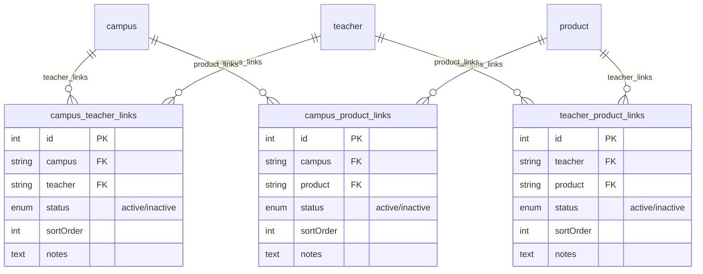

# Phase 1 设计：实体关系重构（campus ↔ teacher ↔ product）

> **创建日期：** 2026-07-22
> **状态：** 待用户审查
> **前置依赖：** Phase 0（版本同步与流程纠正）已完成
> **后续阶段：** Phase 2（课程分类管理）→ Phase 3-5

---

## 1. 背景与目标

### 1.1 问题陈述

当前实体关系模型存在两个核心缺陷：

1. **campus ↔ teacher 是 oneToMany**：一个教师只能属于一个校区。现实中教师跨校区授课很常见，这个约束不符合业务。
2. **campus ↔ product（课程）和 teacher ↔ product（课程）完全没有关联**：课程不知道在哪个校区开、由谁教。前端无法展示"某校区的课程""某教师的课程"。

### 1.2 重要领域发现：课程 = product

经直接验证代码与数据库（非依赖 agent 转述），**本系统不存在独立的 `course` content type**。所谓"课程"就是 `product` content type：

- `product.aiSummary` 描述："给 AI 搜索引擎看的**课程**摘要"
- `product.objectives` = `course.objective` 组件 = "学习目标列表"
- `product.outline` = `course.module` 组件 = "课程大纲分阶段"
- `product.testimonials` = `course.testimonial` 组件 = "家长评价"
- 前端 `app/courses/` 页面取的就是 `/api/products` 数据

因此本设计的三个实体是 **campus、teacher、product**（product = 课程）。

### 1.3 目标

将三个实体之间的关联全部改为**显式中间表承载的多对多关系**，支持关系级 `status` 软删除和扩展字段。

---

## 2. 现状诊断（已直接验证）

### 2.1 数据规模

| 实体 | DB 表 | 记录数 | 唯一 documentId 数 |
|------|-------|--------|-------------------|
| campus | campuses | 24 | 6（× 4 行：草稿+发布 × zh-CN+en-US） |
| teacher | teachers | 24 | 6 |
| product | products | 12 | — |

### 2.2 现有关系

| 关系 | 现状 | 存储位置 | 数据 |
|------|------|---------|------|
| campus ↔ teacher | oneToMany / manyToOne | `teachers_campus_lnk` 表 | 24 行 = 6 唯一对 × 4（draft/pub × 2 locale） |
| campus ↔ product | ❌ 不存在 | — | 0 |
| teacher ↔ product | ❌ 不存在 | — | 0 |

**campus ↔ teacher 现有 6 个唯一映射**（dry-run 验证）：

| teacher | campus |
|---------|--------|
| 王老师 | 百步亭校区 |
| 张老师 | 动物园校区 |
| 赵老师 | 沌口校区 |
| 李老师 | 三阳路校区 |
| 刘老师 | 四新校区 |
| 陈老师 | 钟家村校区 |

### 2.3 不受影响的外部引用

以下 content type 通过 manyToOne 引用 campus/teacher/product 中的单个实体（引用的是实体本身，不是三方互相关联），**保持不变**：page、news-article、feedback、appointment、site-settings、knowledge-base。

---

## 3. 架构设计

### 3.1 三张显式中间表

采用显式 junction collection type（非 Strapi 原生 manyToMany），以便在关系上挂 `status`/`sortOrder`/`notes` 自定义字段。Strapi 原生 manyToMany 的隐式中间表只有两个外键，无法加自定义字段——这是选显式方案的硬技术原因。

```
campus ──┐                                ┌── teacher
         ├─ campus_teacher_links ─────────┤
         │                                │
         ├─ campus_product_links ─────────┐
         │                                ├─ product (课程)
         └────────────────────────────────┘
                                          │
                          teacher_product_links ──┘
```

### 3.2 中间表统一 Schema

三张中间表共享相同字段结构（统一模式，便于扩展）：

| 字段 | 类型 | 说明 |
|------|------|------|
| `<entityA>` | relation manyToOne | 端点实体 A |
| `<entityB>` | relation manyToOne | 端点实体 B |
| `status` | enumeration `active`/`inactive` | 关系级软删除：active=当前有效，inactive=历史归档 |
| `sortOrder` | integer, default 0 | 关系内排序（如某校区下教师的展示顺序） |
| `notes` | text, optional | 关系备注（如"外聘""主讲"等标注） |
| *(自动)* | — | id, documentId, createdAt, updatedAt, createdBy |

**Collection type 配置**：
- `draftAndPublish: false`（中间表不单独走发布流程，跟随父实体）
- `i18n localized: false`（关系是结构性的，不随语言变）

### 3.3 命名规范

| Collection Type | collectionName（DB 表） | 端点字段 |
|----------------|------------------------|---------|
| `campus-teacher-link` | `campus_teacher_links` | campus, teacher |
| `campus-product-link` | `campus_product_links` | campus, product |
| `teacher-product-link` | `teacher_product_links` | teacher, product |

### 3.4 父实体字段调整

| 实体 | 删除 | 新增（oneToMany → 中间表） |
|------|------|---------------------------|
| campus | `teachers` | `teacher_links`（→ campus-teacher-link）、`product_links`（→ campus-product-link） |
| teacher | `campus` | `campus_links`（→ campus-teacher-link）、`product_links`（→ teacher-product-link） |
| product | （无删除） | `campus_links`（→ campus-product-link）、`teacher_links`（→ teacher-product-link） |

共删除 2 个旧关系字段（campus.teachers、teacher.campus），新增 6 个 oneToMany 字段（每实体 2 个）。

### 3.5 ER 图



---

## 4. 数据迁移

### 4.1 迁移范围

| 关系 | 是否有现存数据 | 迁移方式 |
|------|-------------|---------|
| campus ↔ teacher | ✅ 有（24 行 → 6 唯一对） | 迁移脚本读 `teachers_campus_lnk`，去重后写入 `campus_teacher_links` |
| campus ↔ product | ❌ 无（greenfield） | 无需迁移，直接建空表 |
| teacher ↔ product | ❌ 无（greenfield） | 无需迁移，直接建空表 |

### 4.2 迁移脚本

**文件**：`backend/scripts/migrate-to-manytomany.ts`
**辅助 dry-run runner**：`backend/scripts/dry-run-migration.ts`（host 端 pg 直连，绕过容器 lodash/fp 缺失问题）

**迁移逻辑**（已 dry-run 验证）：
1. 读 `teachers_campus_lnk` join teachers + campuses
2. 按 `(teacher.documentId, campus.documentId)` 去重 —— 中间表不本地化，同一教师的 zh-CN/en-US/draft/published 行映射到同一条 junction 记录
3. 按 campus 名 + teacher 名排序，sortOrder 从 0 递增
4. `--execute`：写入 `campus_teacher_links`（幂等：已有数据则跳过）

**dry-run 验证结果**：
- 源 24 行 → 去重 6 条唯一 junction 记录
- 全部 status=active，sortOrder 0-5
- 6 对映射正确（王→百步亭、张→动物园、赵→沌口、李→三阳路、刘→四新、陈→钟家村）

### 4.3 单元测试

**文件**：`backend/scripts/__tests__/migrate-to-manytomany.test.ts`（8 个测试，全部通过）

覆盖：per-locale 去重、documentId 对去重、sortOrder 连续、status 一致、空输入、同校区多教师、同教师多校区（多对多场景）、排序稳定性。

---

## 5. 前端改动

### 5.1 populate 从一层变两层

```ts
// 旧：campus 取教师（一层）
populate: ['teachers']
// 新：campus 取教师（两层，经中间表，按 status 过滤）
populate: { teacher_links: { populate: 'teacher', filters: { status: 'active' } } }
```

### 5.2 需改动的文件

| 文件 | 改动 |
|------|------|
| `lib/api.ts` | getCampuses/getTeachers/getTeacher/getProducts/getProduct 的 populate 参数 |
| `components/campus/CampusTeachers.tsx` | 从 `campus.teacher_links` 映射出 teacher，按 status 过滤 |
| `components/team/TeacherCard.tsx` | 从 `teacher.campus_links` 映射出 campus |
| `components/team/TeacherDetail.tsx` | 同上 |
| course/product 相关组件 | 新增 campus/teacher 展示（之前没有） |

### 5.3 组件适配模式

统一 helper：从 links 数组提取目标实体并按 status 过滤。

```ts
function extractActive<T>(links: any[], targetField: string): T[] {
  return (links || [])
    .filter((l) => l.status === 'active')
    .sort((a, b) => (a.sortOrder ?? 0) - (b.sortOrder ?? 0))
    .map((l) => l[targetField])
    .filter(Boolean);
}
```

---

## 6. 交付物

1. 3 个新 collection type schema（campus-teacher-link / campus-product-link / teacher-product-link）
2. 3 个父实体 schema 调整（删旧字段 + 加新 oneToMany）
3. 迁移脚本（已写 + dry-run 验证）+ 单元测试（8 个通过）
4. 前端 populate + 组件适配
5. **ER 图**（上方 mermaid，写入本文档 + runbook）
6. **模型文档 + API 文档**（Strapi 自动生成 OpenAPI；本文档补充关系语义说明）

---

## 7. 部署策略

遵循 Phase 0 建立的"本地开发 → 测试 → push → 服务器 pull"规范流程：

| 环境 | 操作 | 状态 |
|------|------|------|
| 本地 | 开发 + 迁移 + 单元/集成/功能测试 | 进行中 |
| 测试服务器 124.223.1.67 | push 后 pull，跑迁移脚本 | 待本地验证后 |
| 客户服务器 121.196.210.191 | **暂不部署**，测试服务器稳定后再说 | 阻塞 |

---

## 8. 范围边界（YAGNI）

**本次不做**（未来评估）：
- 拖拽式关系可视化编辑 UI
- 关系冲突检测
- 中间表的 effectiveDate/endDate（有效期）—— 当前 `status` 够用
- 后端 admin 自定义关系管理界面 —— 用 Strapi 原生 content manager 即可

---

## 9. 风险与缓解

| 风险 | 缓解 |
|------|------|
| 删除旧 oneToMany 字段后，旧 API 调用 404 | 前端与后端同步发布；迁移脚本幂等 |
| Strapi schema 变更需重启 + ALTER TABLE | 在 development mode 本地操作，重启自动迁移 |
| 中间表 populate 两层增加查询负担 | 关系数据量小（个位数），影响可忽略 |
| 容器内 lodash/fp 缺失导致脚本无法 `createStrapi().load()` | dry-run 已用 host 端 pg 直连 runner 绕过；execute 同样走 host 端 pg 直连 INSERT（不依赖 strapi 加载） |
